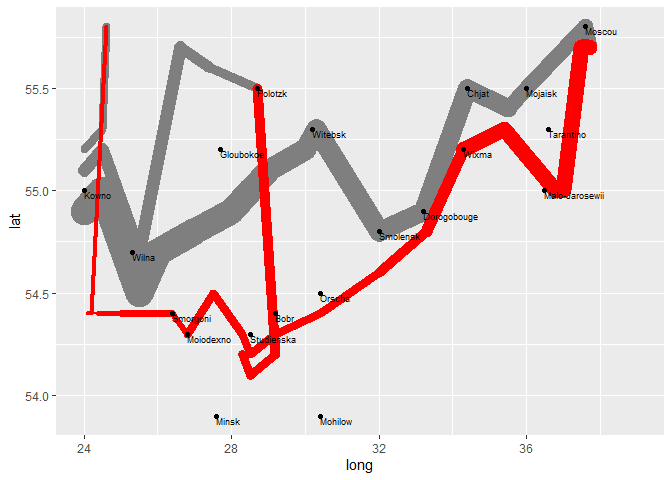
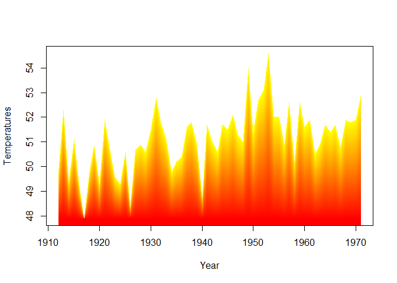
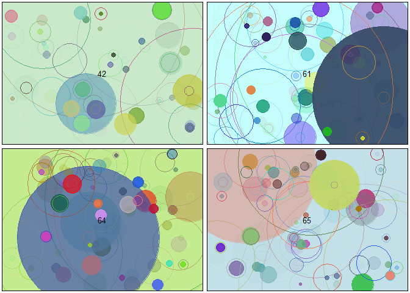
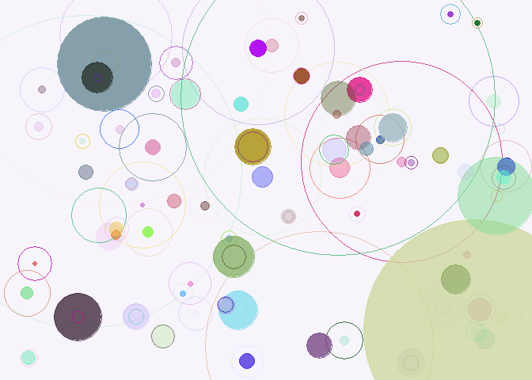
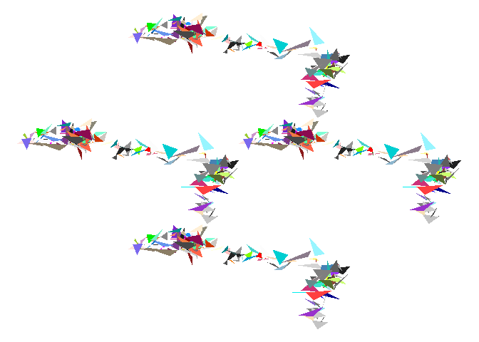
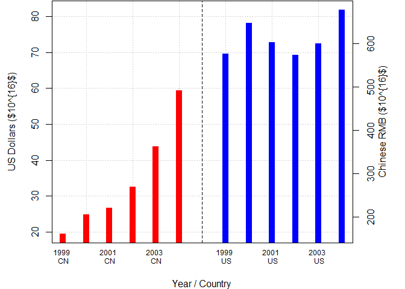
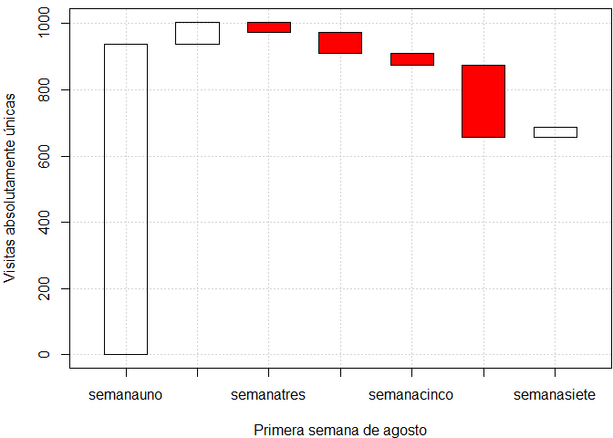

Device Grafics
================
 @Crissthiandi 
2021-03-25

La mayoria de este codigo es publicado con licencia CC por lo que es
publicado en este script sin faltar a dichos derechos.

Saludos lector, esto no tiene nada que ver con analisis de imagen o así,
solo es codigo de un gran hacker de origen chino que admiro mucho y me
gusta ver su contenido ¿Que opinas de su forma de programar?

### Ruta napoleonica

<!-- -->

Esta padre la representación de la caminata napoloonica, no?

#### Degradado

Del como hacer graficos con degradados usando la paqueteria base de R
<!-- -->

#### Rte (R arte)

Le llaman arte con R, no es algo formal pero es interesante como podemos
hacer que unas distribuciones aleatorias nos den graficos lindos.

<!-- -->

#### Cairodevice

Al menos en mi windows no funciona el paquete cairoDevice, supongo debe
ser algo para linux que no corre en windows :c

<!-- -->

    ## png 
    ##   2

#### Poligonos de caledoscopio

<!-- -->

#### incorpora el uso de usage() fun

``` r
library(formatR)
usage(grid)
```

    ## grid(nx = NULL, ny = nx, col = "lightgray", lty = "dotted", lwd = par("lwd"),
    ##     equilogs = TRUE)

#### Barras laterales

<!-- -->

#### Gráfico de cascada

    ## [1]   66  -32  -63  -35 -217   30

<!-- -->
